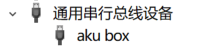
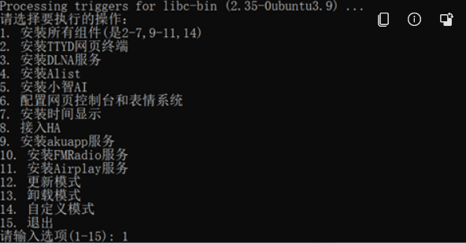

# 🤖 *AKU_ROBOT复活赛*
---

### 1. 前期准备
1. 新入手aku，请打开包装盒，充电4到5小时，然后再使用。避免电量不够，刷机不成功。</br>
    刷机请尽量插电脑的USB2.0接口，有的电脑3.0接口刷机会偶然出问题。
2. 下载驱动 [Zadig.exe](https://zadig.akeo.ie/)
3. 下载刷机包 <kbd>Stable:0525</kbd> []()<a href="./attachments/Hardware/AkuRobot/aku_ubuntu_0525_zheng1_bingqi.tar.gz" target="_blank">aku_ubuntu_0525_zheng1_bingqi.tar.gz</a></kbd>
4. 下载软件包 <kbd>Release:0605</kbd> <a href="./attachments/Hardware/AkuRobot/AKU软件安装-0605.zip" target="_blank">AKU软件安装-0605.zip</a></kbd>
5. 下载安装 VMware Workstation Pro 软件运行Linux虚拟机
6. 下载linux安装包或者群内整合包

### 2. 环境准备
1. VMware安装群内整合包[root:root]（已包含所有环境依赖）</br>
    或@安装原版ubuntu/debian
3. 物理机Windows系统或者运行Windows虚拟机


### 3. 底层系统刷机

#### 3.1 部署Linux环境
1. 编译[Sunxi-tools](https://linux-sunxi.org/Sunxi-tools)，如有报错复制到deepseek查询缺失的依赖
    ```
    apt-get update
    apt-get install libusb-1.0-0-dev zlib1g-dev pkg-config git
    git clone https://github.com/linux-sunxi/sunxi-tools
    cd ./Sunxi-tools
    make
    ```
2. 解压*刷机包*得到*image2*文件夹，放到/root路径下

#### 3.2 开刷
1. 按住顶部电源键10s，会强制关机。
2. 按住侧边音量键+键&顶部电源键5s左右进入刷机模式，然后接入电脑usb。
3. 输入命令 *sunxi-fel ver* </br>
    输出~~AHUSBFEX SOC=00001625(A13)00000001 ver=0001 44 08 scratchpad=00007e00 00000000 00000000~~，则表示连接成功，</br>
    输出~~ERROR:Allwinner UsB FEL device not found!~~，则表示连接失败，重复以上操作。</br>
4. 输入命令
    ```
    cd /root/image2
    ls
    ./flash_all.sh
    ```
5. 六条进度条到100%结束后等自动重启，灯亮后就是刷机完成。</br>
    
6. Windows设备管理器-通用串行总线设备-aku box(刷机成功) </br>
    
   

### 4. 软件安装
<!-- 754b578fd0535c7290dd1d711bafdb28 -->
1. 按住顶部电源键10s，会强制关机。
2. 按住电源键5s左右开机，屏幕闪烁雪花。
3. usb连接电脑，Windows中解压软件包，运行”双击开始.exe” </br>
     </br>
4. 按安装说明依次输入命令
    ```
    .\adb.exe push .\aku.tar.gz /root          ## 功能包复制到aku
    .\adb.exe push .\bluetooth.tar.gz /root    ## 蓝牙包复制到aku
    .\adb.exe shell                          ## 连接aku ssh，连接成功显示AKUBOX标识
    tar -zxvf aku.tar.gz                     ## 解压功能包
    cd aku                                  ## 进入aku文件夹
    ./start.sh                              ## 运行安装脚本，如果是乱码，则运行./start-2312.sh
    ```
5. 按提示输入wifi名称/密码
6. 注意，出现检查时间时，如果不正确不要输入y，输入n，再输入./start.sh </br>
    等一会儿，时间校正完毕后再输入y
7. 安装开始(环境依赖)，耐心等待，可能要十来分钟。
8. 出现菜单栏，根据需求选择安装对应的功能。 </br>
    
9. 等待脚本运行完毕后退出即可。


### 5. 软件售后

#### 5.1 功能使用说明
| 名称 | 组件 | 注释 | 端口号 | 手动开启 | 开机自启 | 取消自启
| :--- | :--- | :--- | :--- | :--- | :--- | :--- 
| TTYD | ttyd | 网页终端 | 1234 | systemctl start ttyd | systemctl enable ttyd | systemctl disable ttyd
| DLNA | dlna |  || systemctl start dlna | systemctl enable dlna | systemctl disable dlna
| ALIST | alist |  | 5244 | systemctl start alist | systemctl enable alist | systemctl disable alist
| 小智AI | xiaozhi |  || systemctl start xiaozhi | systemctl enable xiaozhi | systemctl disable xiaozhi
| WEB | akuweb/sysboot | 网页控制台 | 80 | systemctl start akuweb | systemctl enable akuweb | systemctl disable akuweb
| 时间显示 | showtime |  || systemctl start showtime | systemctl enable showtime | systemctl disable showtime
| wyoming-satellite | ha | 语音识别 |  | systemctl start ha | systemctl enable ha | systemctl disable ha
| Aku app | akumanager | || systemctl start akumanager | systemctl enable akumanager | systemctl disable akumanager
| FM Radio | fm |  || systemctl start fm | systemctl enable fm | systemctl disable fm
| Airplay | shairport-sync | || systemctl start shairport-sync | systemctl enable shairport-sync | systemctl disable shairport-sync
| SSH | \ | root:1234  | 22 | \ | \ | \ 

1. 更换WiFi, 输入命令 /root/aku/wifi.sh
3. 调节音量大小:amixer set 'Power Amplifier' 30
    （0-63）
4.	关闭aku的LED灯:echo 0 >/sys/class/leds/aku-logo/brightness
5.	充电动画删除mv /opt/aku/web/charging /opt/aku/web/charging_disable
6.	开机，充电动画替换步骤（看小小白整理的聊天记录）

#### 5.2 小知识
1. 长按顶部电源按钮，看到屏幕闪动几下，正面led亮起，表示开机。
2. 不管设备处于什么工作状态，长按顶部电源键大概10秒，都会关机。
3. 开机默认是DLNA模式。出现眼睛的表情时，可以长按电源键，在DLNA和小智功能之间来回切换。</br>
    很多音乐APP都支持DLNA投频播放，目前已知酷我APP、网易云APP，vivo手机自带的i音乐APP可以，更多的自行尝试。或者网上下载其他的投屏APP尝试。
4. test9版本开始，带有时间模式。</br>
    开机之后，双击顶部电源键，然后按住音量+，就进入时间模式。退出该模式，也是长按音量+。


