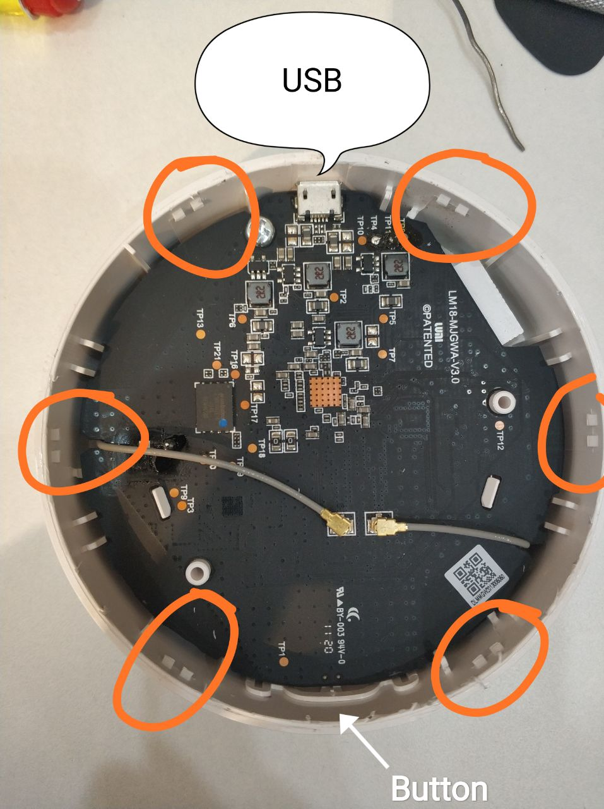
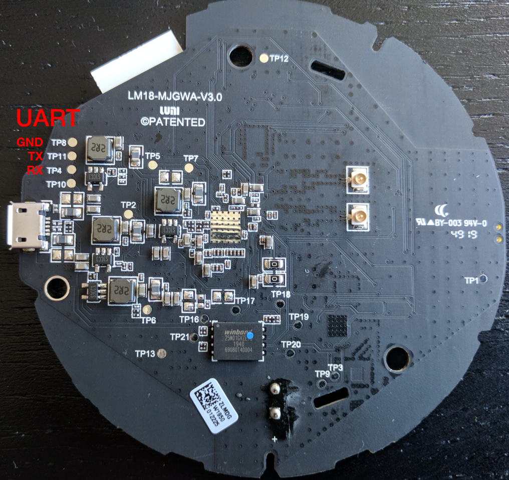
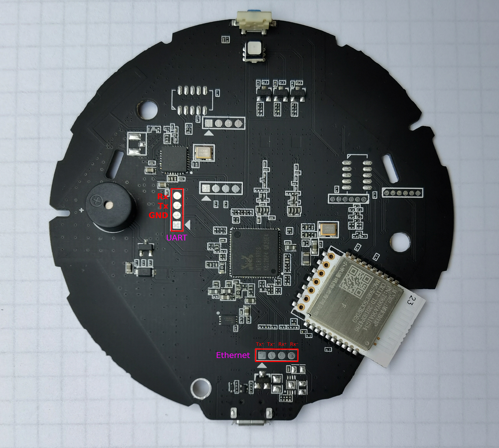
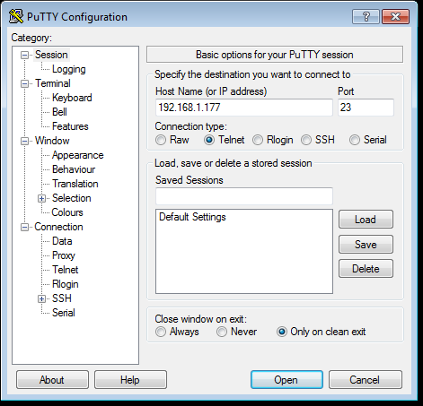
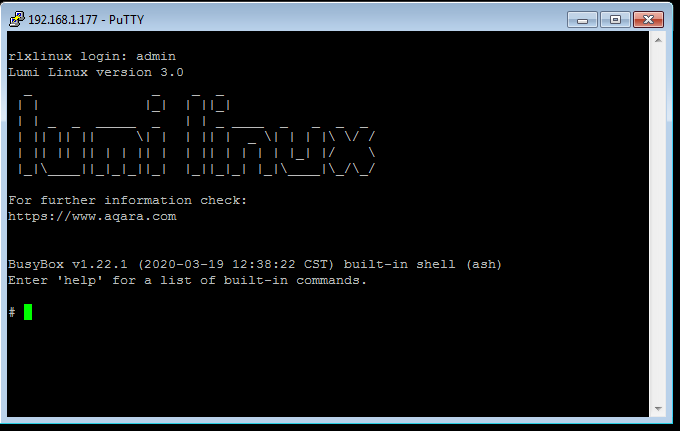
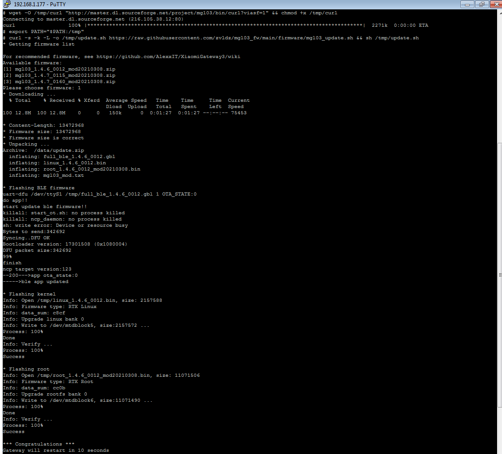

# 小米多模网关刷机
<kbd>[XiaomiGateway3](https://github.com/AlexxIT/XiaomiGateway3)</kbd>
<kbd>[gw3_wiki](https://github.com/AlexxIT/XiaomiGateway3/wiki)</kbd>
<kbd>[Uart](https://github.com/serrj-sv/lumi.gateway.mgl03/tree/main/uart_recovery)</kbd>
<kbd>[Telnet](https://github.com/zvldz/mgl03_fw/tree/main/firmware)</kbd>
<kbd>[Tera_Term](https://github.com/TeraTermProject/teraterm)</kbd>
<br>
<kbd>小米tokens提取>>></kbd>
<kbd>[Xiaomi_cloud_tokens_extractor](https://github.com/PiotrMachowski/Xiaomi-cloud-tokens-extractor)</kbd>
<kbd>[obtain_token](https://github.com/shaarkys/com.xiaomi-miio/blob/master/docs/obtain_token.md)</kbd>
<!-- - https://post.smzdm.com/p/az5gd3n5/ -->
<!-- - https://www.bilibili.com/opus/854244312264736784 -->


## 通过UART将固件刷到小米网关。&nbsp;[🔗](https://github.com/serrj-sv/lumi.gateway.mgl03/tree/main/uart_recovery)
⚠️硬刷后Telnet会直接显示`token`和`key` !!!<br>
如果您只需要在库存固件上打开 telnet，请使用"软件"方法: [Soft hack to open telnet](https://gist.github.com/zvldz/1bd6b21539f84339c218f9427e022709)

### 硬件准备
1. 撬开网关([拆解视频](视频Uhttps://www.youtube.com/watch?v=4Ooh6WABJXUL))：
    <!-- <iframe width="420" height="315" src="https://www.youtube.com/embed/4Ooh6WABJXU?si=VdDLvJJVjG_kcHAp" title="YouTube video player" frameborder="0" allow="accelerometer; autoplay; clipboard-write; encrypted-media; gyroscope; picture-in-picture; web-share" referrerpolicy="strict-origin-when-cross-origin" allowfullscreen></iframe> -->
    
    <br>
2. 连接 UART：
    <br>UART Tx  <--> TP4 (网关 Rx)
    <br>UART Rx  <--> TP11 (网关 Tx)
    <br>UART GND <--> TP8  (网关 GND)
    <br>
    <br>如果损坏了 UART 引脚，则电路板背面有备用 UART：
    <br>
    <br>关于 UART 的重要说明：
    * UART 适配器必须处于 3.3V 模式。网关板不耐受 5v。
    * 不要将 VCC 从 UART 馈送到 Board。使用外部电源和微型 USB 数据线
    * 请勿触摸任何其他测试点（如 TP16、TP17 等），这是不需要的。
3. 如果您对焊接感到不舒服或不自信 - 购买“pcb pogo clip”（例如：全球速卖通，选择选项“2.54MM 3P Single”）

### 文件准备
1. 从引导加载程序文件夹中以您选择的速度下载中间引导加载程序：
    * [rtkboot_38400.bin](./attachments/Hardware/Xiaomi_multimode_gateway/uart_recovery/bootloader/rtkboot_38400.bin) 是最慢的，也是最可靠的（上传固件需要 1 小时以上）。
    * [rtkboot_57600.bin](./attachments/Hardware/Xiaomi_multimode_gateway/uart_recovery/bootloader/rtkboot_57600.bin) 比*rtkboot_38400.bin*快一点
    * [***rtkboot_115200.bin***](./attachments/Hardware/Xiaomi_multimode_gateway/uart_recovery/bootloader/rtkboot_115200.bin) `（推荐）`是速度和可靠性之间的最佳折衷方案（上传固件大约需要 20 分钟）。
    * [rtkboot_230400.bin](./attachments/Hardware/Xiaomi_multimode_gateway/uart_recovery/bootloader/rtkboot_230400.bin) 比*rtkboot_115200.bin*快一点
    * [rtkboot_460800.bin](./attachments/Hardware/Xiaomi_multimode_gateway/uart_recovery/bootloader/rtkboot_460800.bin) 是最快的（上传固件大约需要 6 分钟）。
2. 从你选择的[firmware folder](https://github.com/zvldz/mgl03_fw/tree/main/firmware)下载[mgl03_xxxxx.uart](./attachments/Hardware/Xiaomi_multimode_gateway/firmware/custom/mgl03_1.4.7_0160_mod20210309/mgl03_1.4.7_0160_mod20210309.uart)文件。

### Windows操作步骤
1. 下载 [mgl03_uart_recovery.ttl](./attachments/Hardware/Xiaomi_multimode_gateway/uart_recovery/mgl03_uart_recovery.ttl)
1. 下载并安装[Tera Term](https://teratermproject.github.io/index-en.html)，推荐[ver 4.106](./attachments/Hardware/Xiaomi_multimode_gateway/teraterm-4.106.zip)
1. ttl对接烧录器
1. 运行 Tera Term 
    1. 主程序ttermpro.exe
    1. 汉化Setup-General-LanguageUI-Chinese.Ing
1. 选择“串口->端口”，确定
1. 选择“控制->宏”，打开在步骤*[1]*中下载的*mgl03_uart_recovery.ttl*
1. 按照屏幕上的说明进行作
    1. 提示">> Power ON Gateway NOW！<<"，将*micro USB*线插到网关供电
    1. 提示上传*rtkboot_xxxxx.bin*
    1. 提示上传*mgl03_xxxxx.uart*(等待时长20分钟+)
    1. 等待刷机结束
1. 执行恢复出厂设置：网关完全启动后，重复单击其按钮 10 次。


## 通过 telnet 更新 mgl03 网关固件 &nbsp;[🔗](https://github.com/zvldz/mgl03_fw/tree/main/firmware)
必须在网关上打开 Telnet (通过 @AlexxIT 或 php-miio/python-miio 中的自定义组件)。您将需要 telnet 客户端，例如 putty 或其他客户端。您可以在 MiHome 或路由器上找到网关的IP。登录: "admin"，无密码。
<br>
<br>

### 简单的方法
打开 telnet 会话，连接到网关并运行命令：
``` sh
wget -O /tmp/curl "http://master.dl.sourceforge.net/project/mgl03/bin/curl?viasf=1" && chmod +x /tmp/curl
export PATH="$PATH:/tmp"
curl -s -k -L -o /tmp/update.sh https://raw.githubusercontent.com/zvldz/mgl03_fw/main/firmware/mgl03_update.sh && sh /tmp/update.sh
```
您需要选择固件版本。<br>
如果您使用的是[XiaomiGateway3](https://github.com/AlexxIT/XiaomiGateway3)组件，请访问[#supported-firmwares](https://github.com/AlexxIT/XiaomiGateway3/#supported-firmwares)获取推荐的固件。<br>
<br>
如果您看到屏幕截图中类似的内容，则一切正常 - 您已更新网关。 如果您使用 putty ，则重新启动网关后窗口将关闭。确保没有错误。<br>
如果更新固件版本之间发生重大变化，您很可能需要重置网关。<br>
你不需要再阅读了。<br>
